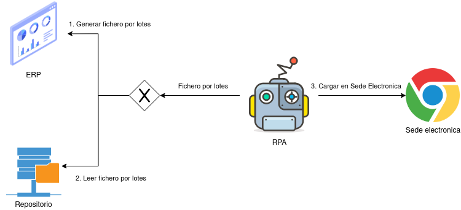
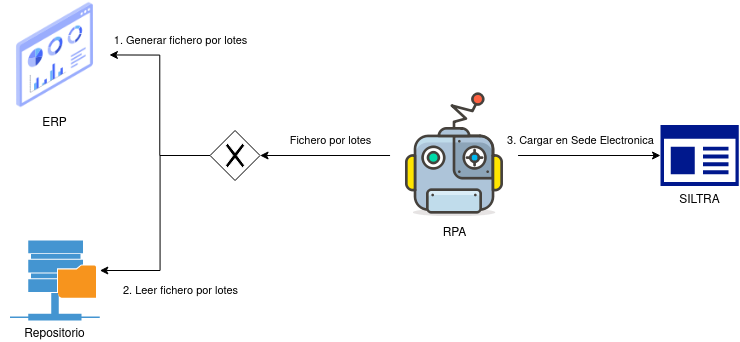
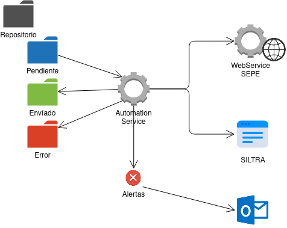

# Automatización de servicios de la Administración Pública

by Xose Eijo 2021/02/26

<< BORRADOR >>

## Introducción

En este documento se recogen algunos de los servicios de interoperatividad con las Administraciones Públicas del estado. El objetivo del documento es analizar como se realiza esta interoperatividad y que posibilidades de automatización presentan a través de servicios backend o RPA.

Los servicios que se analizaran en este documento son:

- Certific@2 del Sepe.
- Contrat@ del Sepe.
- Siltra de la Seguridad Social.
- Modelo 111 de la Agencia tributaria.

## Descripción de los servicios

### Certific@2

Este servicio permite el envío a través de Internet, por parte de las empresas, de los **certificados de empresa de ceses por suspensión o extinción de la relación laboral**.

#### Interoperatibilidad

El servicio Certific@2 ofrece dos medios de comunicación:

- **Sede electrónica:** a través del portal se pueden entregar los certificados de dos formas:
  - subida del fichero XML con los datos de los empleados.
  - cubriendo el formulario web, empleado a empleado.
- **Servicio Web**: este es medio desatendido para la comunicación de los certificados de empresa. El sistema del empresario debe generar el fichero XML y comunicarlo al Servicio Web.

#### Otra información relevante

La sede electrónica posibilita el uso de un entorno de pruebas para la puesta a punto de los ficheros. El entorno requiere identificación de la empresa.

La documentación para la generación del fichero XML y el desarrollo del cliente de `web service` se encuentra en el portal de Certific@2 por lo que es necesario identificarse para descargar esta información.

### Contrat@

#### Interoperabilidad

Esta web facilita la comunicación de la contratación on-line a través de la aplicación Contrat@. 

El servicio Certific@2 ofrece dos medios de comunicación:

- **Sede electrónica:** a través del portal se pueden entregar lcontratos de dos formas:
  - subida del fichero XML con los datos de los empleados.
  - cubriendo el formulario web, empleado a empleado.
- **Servicio Web**: este es medio desatendido para la comunicación de los contratos de empresa. El sistema del empresario debe generar el fichero XML y comunicarlo al Servicio Web.

#### Otra información relevante

La sede electrónica posibilita el uso de un entorno de pruebas para la puesta a punto de los ficheros. El entorno requiere identificación de la empresa.

La documentación para la generación del fichero XML y el desarrollo del cliente de `web service` se encuentra en el portal de Certific@2 por lo que es necesario identificarse para descargar esta información.

### Modelo 111

Es el modelo de presentación de las auto-liquidaciones de retenciones e ingresos a cuenta del IRPF. Están obligadas a presentar esta declaración todas aquellas empresas o personas que estén obligadas a retener o ingresar a cuenta del IRPF. El periodo de presentación va dependiendo del tipo de entidad es:

| Entidad                                      | Periodo    | Forma de presentación    |
| -------------------------------------------- | ---------- | ------------------------ |
| Grandes empresas                             | Mensual    | Sede electrónica         |
| Adm Públicas con presupuesto superior a 6 M. | Mensual    | Sede electrónica         |
| SAs y SLs, resto de adms públicas            | Trimestral | Sede electrónica         |
| Personas físicas y otros                     | Trimestral | Sede electrónica / papel |

#### Interoperabilidad

Sede electrónica o papel. Se puede subir un fichero de procesado por lotes.

#### Otra información relevante

Los servicios web de la AEAT permiten el comunicado de varios modelos a través de servicio web, por el momento el modelo 111 no está disponible.

### SILTRA

La Tesorería General de la Seguridad Social (TGSS) ha venido trabajando en los últimos años en el Sistema de Liquidación Directa de cotizaciones a la Seguridad Social, que le permitirá adoptar un papel activo en el proceso de recaudación, pasando de un modelo de autoliquidación a un modelo de facturación, así como proporcionar mayor información sobre las cotizaciones a empresas y trabajadores a través de un modelo de atención personalizado y multicanal.

Los objetivos prioritarios del Sistema de Liquidación Directa son: minimizar los errores al asumir la TGSS la aplicación de las reglas de cotización y contrastar los datos con carácter previo a la liquidación y mejorar la transparencia y la forma de relación con las empresas basada en un sistema plenamente telemático eliminando la necesidad de actuaciones presenciales y en soporte papel.

Este sistema supone modificaciones en el actual procedimiento de intercambio de información, tratamiento, estructura y formato de los ficheros con el que los usuarios del Sistema RED se relacionan con la TGSS.

#### Interoperabilidad

Para el envío de los ficheros de Cotización y Afiliación a la TGSS, esta entidad ofrece el aplicativo SILTRA, a través del cual deben hacerse los envíos.

#### Otra información relevante

Se puede utilizar SILTRA como servicio desatendido sin que el usuario intervenga en el envío. Para realizar este tipo de envíos se debe llamar al fichero siltra.jar pasando como parámetro la ruta del fichero xml. Sí los envíos de afiliación o cotización están configurados como Validar, Adaptar y Enviar  no será necesaria la intervención del usuario, por el contrario si están marcados como validación y adaptación, será necesario el usuario haga el envío manualmente.

## Vías de automatización

### Modelo RPA

#### Certific@2

La automatización con RPA presenta dos alternativas, dependiendo de la funcionalidad de ERP. 

Cuando el ERP disponga de la opción de generación de certificados de empresa por lotes,  esta tarea puede automatizarse con un RPA. En caso contrario, el fichero XML debe almacenarse en un repositorio y posteriormente será subido a la sede electrónica por el RPA.

En cuanto a la gestión de errores, el RPA comprobara que la subida a la sede electrónica es correcta, de no serlo, debe generar una alerta para que el usuario resuelva el problema. No es posible automatizar la resolución, puesto que el error puede venir de un fallo en el generador de XML o en los datos del empleado.

#### Contrat@

La automatización con RPA presenta dos alternativas, dependiendo de la funcionalidad del ERP. 

Cuando el ERP disponga de la opción de generación de contratos por lotes,  esta tarea puede automatizarse con un RPA. En caso contrario, el fichero XML debe almacenarse en un repositorio y posteriormente será subido a la sede electrónica por el RPA.

En cuanto a la gestión de errores, el RPA comprobara que la subida a la sede electrónica es correcta, de no serlo, debe generar una alerta para que el usuario resuelva el problema. No es posible automatizar la resolución, puesto que el error puede venir de un fallo en el generador de XML o en los datos del empleado.

#### Modelo 111

La automatización con RPA presenta dos alternativas, dependiendo de la funcionalidad del ERP. 

Cuando el ERP disponga de la opción de generación de liquidaciones irpf por lotes,  esta tarea puede automatizarse con un RPA. En caso contrario, el fichero XML debe almacenarse en un repositorio y posteriormente será subido a la sede electrónica por el RPA.

En cuanto a la gestión de errores, el RPA comprobara que la subida a la sede electrónica es correcta, de no serlo, debe generar una alerta para que el usuario resuelva el problema. No es posible automatizar la resolución, puesto que el error puede venir de un fallo en el generador de XML o en los datos del empleado.

#### SILTRA

La automatización con RPA presenta dos alternativas, dependiendo de la funcionalidad del ERP. 

Cuando el ERP disponga de la opción de generación de cotizaciones y afiliación por lotes,  esta tarea puede automatizarse con un RPA. En caso contrario, el fichero XML debe almacenarse en un repositorio y posteriormente será cargado en Siltra, donde se validará, adaptará y enviará..

En cuanto a la gestión de errores, el RPA comprobará que la comunicación sea correcta, de no serlo, debe generar una alerta para que el usuario resuelva el problema. No es posible automatizar la resolución, puesto que el error puede venir de un fallo en el generador de XML o en los datos del empleado.

### Modelo Back-End

El modelo general de comunicación `back-end` se basa en el desarrollo de un servicio capaz de interoperar con distintos `web services` de las administraciones públicas.

#### Certific@2

La automatización backend pasa por la generación de un cliente para el `web service,` este cliente estaría constantemente leyendo la carpeta pendiente de envío del repositorio de certificados.  Cada vez que detecta un nuevo fichero lo envía y lo mueve a  la carpeta enviados.

Si se produce algún error se notifica una alerta y se mueve el fichero a errores. No es posible automatizar la resolución, puesto que el error puede venir de un fallo en el generador de XML o en los datos del empleado.

#### Contrat@

La automatización backend pasa por la generación de un cliente para el `web service`, este cliente estaría constantemente leyendo la carpeta pendiente de envío del repositorio de contratos.  Cada vez que detecta un nuevo fichero lo envía y lo mueve a  la carpeta enviados.

Si se produce algún error se notifica una alerta y se mueve el fichero a errores. No es posible automatizar la resolución, puesto que el error puede venir de un fallo en el generador de XML o en los datos del empleado.

#### Modelo 111

No aplica una automatización backend, dado que no existe un `web service` de la AEAT que lo soporte.

#### Siltra

La automatización por backend del envío de cotizaciones y afiliaciones a la TGSS a través de SILTRA, no puede realizarse en su totalidad. Esto se debe a que aunque se use el modo desatendido de la aplicación, no es posible gestionar errores. 

La solución pasa por crear un servicio que lee constantemente la carpeta de pendiente de envío del repositorio y cuando detecta un nuevo fichero lo carga en Siltra, con la configuración de validación y adaptación automáticos; al finalizar llama a un RPA que comprueba que no haya errores en los ficheros a enviar y realiza el envío.

En cuanto a la gestión de errores, el RPA comprobará que la comunicación sea correcta, de no serlo, debe generar una alerta para que el usuario resuelva el problema. No es posible automatizar la resolución, puesto que el error puede venir de un fallo en el generador de XML o en los datos del empleado.

